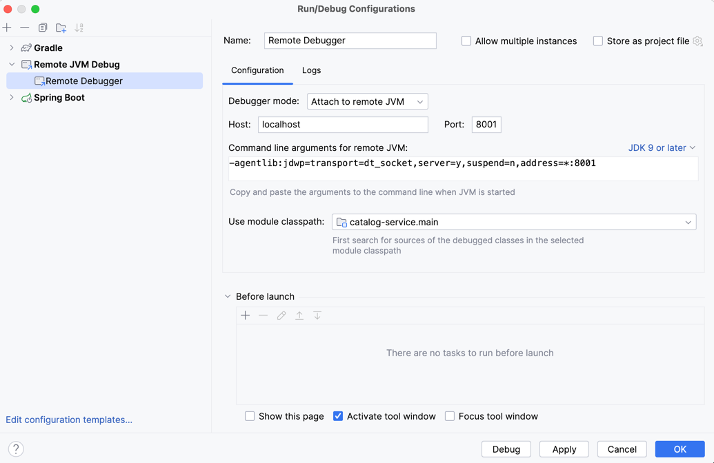

# Managing the deployment parts of polar-book application CLOUD NATIVE

For the docker-compose.yml file the following is added as an env-var:
```yaml
    environment:
      - BPL_JVM_THREAD_COUNT=50
```
which is setting number of threads memory should be allocated for in the JVM stack.
The default value is 250 - but because this project requires some running containers,
the value is lowered so the computer won't be overloaded.

Spin up the containers described in the `docker-compose.yml` file if placed in directory
containing the docker-compose.yml file:
```bash
docker-compose up -d
```
else:
```bash
docker-compose -f docker/docker-compose.yml up -d
```

If changes have been made to the `docker-compose.yml` file then docker-compose up -d
will reload the affected containers and not the ones already running which hasn't changed
(important to either stand in directory with docker-compose file or give as an argument the path):
```bash
docker-compose up -d
```

To stop and remove docker containers executed with docker-compose:
```bash
docker-compose down
```

## To access remote debugger if it´s enabled within `docker-compose.yml` file:


# The docker-compose.yml
```yaml
    volumes: # Mount the initialization SQL script to the container as a volume
      - ./postgresql/init.sql:/docker-entrypoint-initdb.d/init.sql
```
The provided piece from the yaml file defines
a volume which allocates space for storing backup for 
the running dbs on physical memory local machine.
Kubernetes doesn't deal with data persistence which
makes the volumes very efficient.

#### Build and run all the docker images with Tilt
Make sure that minikube is started with profile polar:
```bash
minikube start --profile polar
```
And then execute `tilt up`:
```bash
tilt -f kubernetes/applications/development/Tiltfile up
```